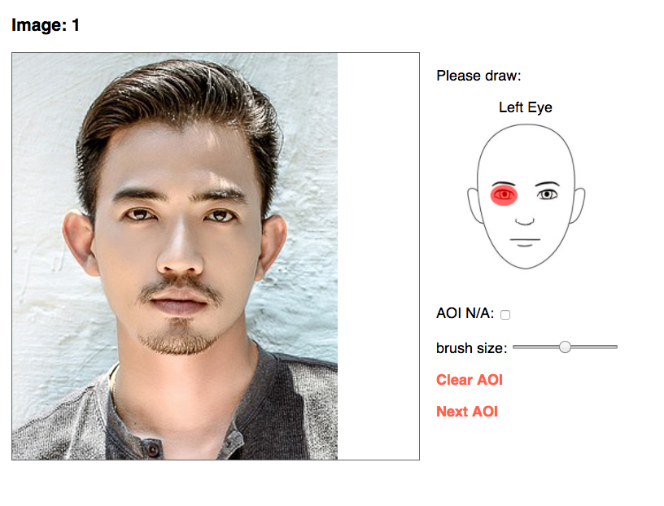

# AOIdraw - AOI drawing tool

Javascript-based drawing application for drawing facial AOIs on a specified set of images. 

Add desired images to _images/ directory and update stimList2.csv to reflect the order in which you want the stimuli to appear. 

For each image, participants will be asked to draw separate AOIs for Left Eye, Right Eye, Nose, and Mouth. Each AOI gets saved as a unique .png image file in data/

**Note:** Must be hosted via PHP-enabled webserver in order to properly save AOI images. 